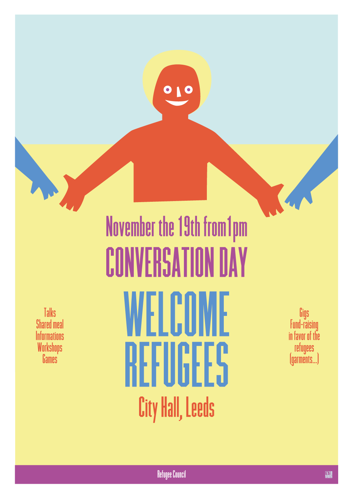
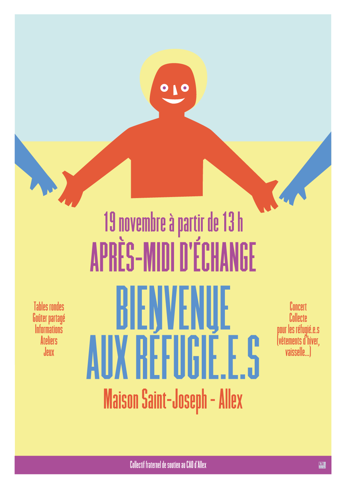
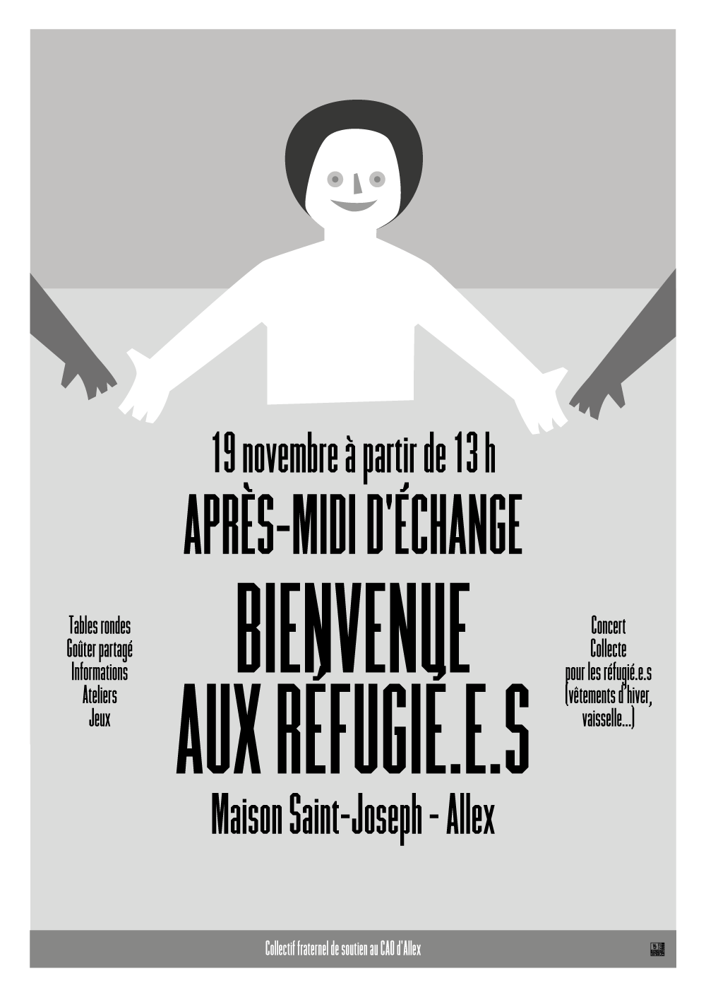

#Welcome refugees

*ENG*
This is an open source poster you can use to communicate about an event to welcome refugees in your town. The poster is made with wide margins to be easily printed on a desktop printer. Also, There's a black an white version depending on your printer. Use and modify this poster freely.

The font used is [Commune B1San](https://wiki.nuitdebout.fr/wiki/Ressources/Logotype_et_caract%C3%A8re_typographique_de_la_Nuit_Debout), a typeface designed by *Sébastien Marchal* and distributed freely for the Nuit Debout communication under [Creative Commons BY-NC-ND licence](https://creativecommons.org/licenses/by-nc-nd/4.0/).

## License
This poster is available under the [Free Art License](http://artlibre.org/licence/lal/en/).

 

*FR*
